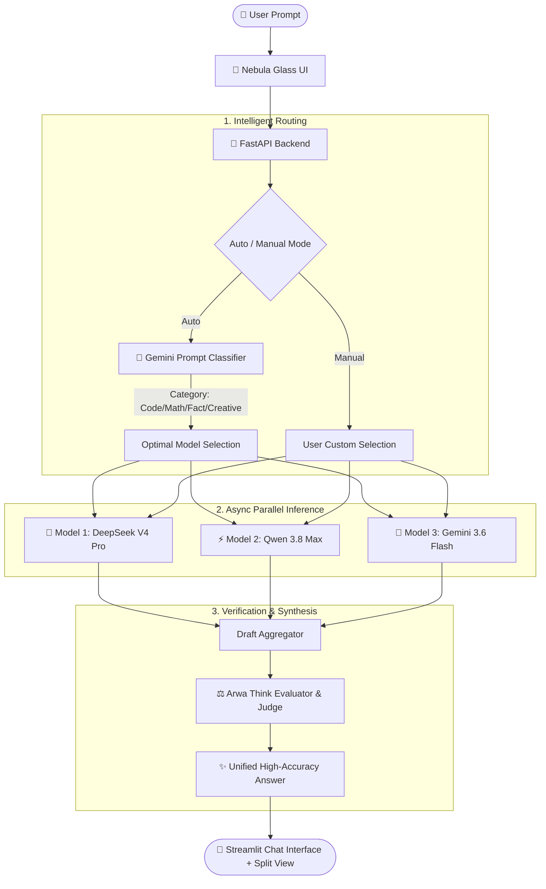

<div align="center">

# 🧠 Arwa Think
### *The Next-Gen Multi-Model AI Routing, Verification & Synthesis Engine*

[](https://python.org)
[](https://fastapi.tiangolo.com)
[](https://streamlit.io)
[](https://opensource.org/licenses/MIT)

<p align="center">
  <b>Arwa Think</b> intelligently routes your prompts across the world's most capable AI models, executes parallel inference, and synthesizes multiple independent perspectives into one unified, ultra-accurate answer.
</p>

---

</div>

## 🌌 Overview

Modern LLMs excel in different areas—some lead in deep mathematical reasoning, others in coding precision, and others in rapid-fire creative responses. **Arwa Think** removes the guesswork by combining multiple frontier models behind a single, ultra-premium interface.

- **🎯 Smart Auto-Routing:** Analyzes prompts and categorizes them (*Math, Code, Creative, Fact*) to dispatch to domain-optimized models.
- **⚡ Parallel Asynchronous Execution:** Dispatches prompts across multiple models simultaneously via `asyncio`.
- **⚖️ Cross-Model Verification & Synthesis:** Evaluates independent model drafts using an AI Judge to produce an accurate, hallucination-free response.
- **✨ "Nebula Glass" UI:** Dark-mode first OLED interface with frosted glassmorphism, Aurora gradients, and pulsating generative animations.

---

## 🏗️ Architecture



---

## 🎛️ Model Roster & Tiers

Arwa Think features a curated catalog of 15 top-tier models organized into three performance tiers:

| Tier | Icon | Focus | Featured Models |
| :--- | :---: | :--- | :--- |
| **Think** | 🧠 | Deep reasoning, complex mathematics, and multi-step logic | `DeepSeek V4 Pro`, `Qwen 3.8 Max`, `Kimi K3`, `Muse Glimmer 30B` |
| **Medium** | ⚡ | Balanced speed, structured coding, and versatility | `GLM 5.2`, `Kimi K2.7 Code`, `Nemotron 3 Ultra`, `Inkling`, `Qwen 3.7 Plus` |
| **Fast** | 🚀 | Instant responses, summaries, and general queries | `DeepSeek V4 Flash`, `Gemini 3.6 Flash`, `Nemotron Lightning`, `Minimax M3`, `GPT-OSS 120B` |

---

## 🚀 Routing Modes

1. **Auto (Smart Route)** *(Default)*: Automatically classifies prompt intent and queries 3 domain-specialized models before synthesizing the final answer.
2. **One Think**: Direct query to a frontier reasoning model for heavy-lifting tasks.
3. **One Fast**: High-speed, single-shot generation for rapid iteration.
4. **Multi-Model (Comparison View)**: Select up to **8 models** to execute in parallel. Displays a side-by-side split screen of individual model outputs below the synthesized answer.

---

## 🛠️ Quick Start Guide

### Prerequisites
- Python 3.10 or higher
- Git
- API Keys: [Google AI Studio](https://aistudio.google.com/) and [Fireworks AI](https://app.fireworks.ai/)

### 1. Clone the Repository
```bash
git clone https://github.com/Zubaire404/Arwa-Think.git
cd Arwa-Think
```

### 2. Create and Activate Virtual Environment
```bash
# Windows
python -m venv venv
.\venv\Scripts\activate

# macOS / Linux
python3 -m venv venv
source venv/bin/activate
```

### 3. Install Dependencies
```bash
pip install -r requirements.txt
```

### 4. Configure Environment Variables
Create a `.env` file in the root directory (or copy from `.env.example`):
```env
GEMINI_API_KEY="your_gemini_api_key_here"
FIREWORKS_API_KEY="your_fireworks_api_key_here"
GROQ_API_KEY="your_groq_api_key_here"           # Optional
OPENROUTER_API_KEY="your_openrouter_api_key_here" # Optional
```

### 5. Launch the Application

**Terminal 1 — Start the FastAPI Backend:**
```bash
uvicorn main:app --host 127.0.0.1 --port 8000 --reload
```

**Terminal 2 — Start the Streamlit Frontend:**
```bash
streamlit run frontend.py --server.port 8501
```

Open **[http://localhost:8501](http://localhost:8501)** in your browser!

---

## 📡 API Reference

### `POST /chat`

**Request Body:**
```json
{
  "prompt": "Explain quantum computing in simple terms.",
  "auto_route": true,
  "manual_models": []
}
```

**Response:**
```json
{
  "final_answer": "Quantum computing harnesses the principles of quantum mechanics...",
  "models_used": ["Gemini 3.6 Flash", "DeepSeek V4 Pro", "Qwen 3.8 Max"],
  "category": "Fact",
  "drafts": [
    {
      "label": "Gemini 3.6 Flash",
      "text": "..."
    }
  ]
}
```

---

## 🎨 UI/UX Features

- **Nebula Glass Aesthetic:** Frosted glassmorphism cards with backdrop filters (`blur(16px)`).
- **Generative Micro-Interactions:** Subtle pulsating glow animations that mimic AI "thinking" during generation.
- **Model Badges:** Dynamically indicates the active models contributing to each synthesized response.
- **Responsive Split Comparison:** Real-time side-by-side columns to compare raw outputs across multiple AI providers.

---

## 🔒 Security & Best Practices

- **Zero-Leak Policy:** `.env` is strictly untracked via `.gitignore` to protect API credentials.
- **Graceful Fallbacks:** Built-in error resilience ensures that if an upstream provider fails, surviving drafts are used without breaking the session.
- **Rate-Limit & Parallel Guards:** Multi-model selector includes interactive warnings when querying more than 4 models simultaneously.

---

## 📄 License

This project is licensed under the [MIT License](LICENSE).

---

<div align="center">
  <b>Built with ❤️ by <a href="https://github.com/Zubaire404">Zubaire404</a></b>
</div>
